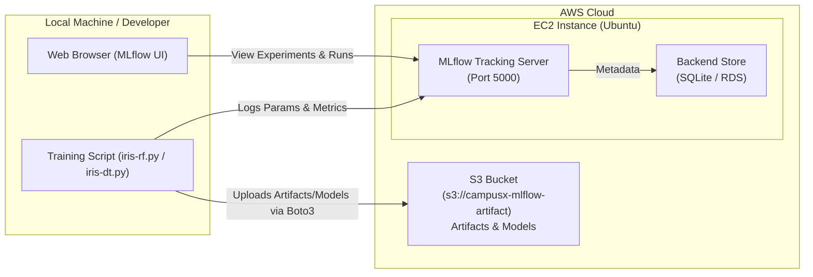

# End-to-End Guide: MLflow Tracking Server on AWS (EC2 + S3)

This guide walks you through setting up and running a production-ready **MLflow Tracking Server** on an **AWS EC2** instance with **Amazon S3** as the remote artifact repository, and connecting your local training scripts to it.

---

## 🏗️ Architecture Overview



---

## 📋 Prerequisites & AWS Setup

Before running commands on the server:
1. **Launch an EC2 Instance**:
   - **AMI**: Ubuntu Server 22.04 LTS or 24.04 LTS (x86_64).
   - **Instance Type**: `t2.micro` / `t3.micro` (free tier eligible) or higher.
2. **Configure Security Group (Inbound Rules)**:
   - **SSH**: Port `22` (Source: `My IP`).
   - **Custom TCP**: Port `5000` (Source: `0.0.0.0/0` or `My IP`) for MLflow UI & API.
3. **Create an S3 Bucket**:
   - Example name: `campusx-mlflow-artifact`
   - Keep bucket private and note down the bucket URI: `s3://campusx-mlflow-artifact`.
4. **IAM Permissions**:
   - Create an IAM user or role with `AmazonS3FullAccess` (or read/write policy to your bucket).

---

## 🚀 Step-by-Step Implementation

### Step 1: Connect to EC2 & Update System Packages

SSH into your Ubuntu EC2 instance:
```bash
ssh -i /path/to/your-key.pem ubuntu@<EC2_PUBLIC_IP>
```

Update package repositories and upgrade existing packages:
```bash
sudo apt update && sudo apt upgrade -y
```

---

### Step 2: Install Python, pipx & Pipenv

Install `python3-pip` and `pipx`:
```bash
sudo apt install python3-pip pipx -y
```

Ensure `pipx` binaries are added to your environment path:
```bash
sudo pipx ensurepath
```

Install `pipenv` using `pipx`:
```bash
pipx install pipenv
```

Ensure `~/.local/bin` is permanently added to `$PATH`:
```bash
# Add to current session
export PATH=$PATH:/home/ubuntu/.local/bin

# Persist across sessions
echo 'export PATH=$PATH:/home/ubuntu/.local/bin' >> ~/.bashrc
source ~/.bashrc
```

---

### Step 3: Set Up the Project Directory & Virtual Environment

Create a project folder and navigate inside:
```bash
mkdir mlflow
cd mlflow
```

Create and activate a new isolated virtual environment using `pipenv`:
```bash
pipenv shell
```

Install the required packages:
```bash
pipenv install setuptools mlflow awscli boto3
```

> [!NOTE]
> - `setuptools`: Ensures `pkg_resources` and build tools are available.
> - `mlflow`: Installs the core MLflow Tracking Server engine.
> - `awscli` & `boto3`: Required for AWS authentication and S3 artifact storage integration.

---

### Step 4: Configure AWS Credentials on EC2

Run the AWS CLI configuration wizard inside the virtual environment:
```bash
aws configure
```

Fill in the prompts:
```text
AWS Access Key ID [None]: YOUR_AWS_ACCESS_KEY_ID
AWS Secret Access Key [None]: YOUR_AWS_SECRET_ACCESS_KEY
Default region name [None]: us-east-1  (or your bucket's region e.g. ap-south-1)
Default output format [None]: json
```

> [!TIP]
> **Production Best Practice**: Instead of hardcoding access keys via `aws configure`, attach an **IAM Role** to your EC2 instance with S3 access policies. `boto3` and `awscli` will automatically discover credentials via instance metadata.

---

### Step 5: Start the MLflow Tracking Server

#### A. Basic Run (Foreground)
```bash
mlflow server \
    --host 0.0.0.0 \
    --port 5000 \
    --default-artifact-root s3://campusx-mlflow-artifact
```

#### B. Production Run (Background with `nohup` / persistent across SSH disconnects)
To keep the server running after closing your terminal:
```bash
nohup mlflow server \
    --host 0.0.0.0 \
    --port 5000 \
    --backend-store-uri sqlite:///mlflow.db \
    --default-artifact-root s3://campusx-mlflow-artifact \
    > mlflow.log 2>&1 &
```

- Check server status:
  ```bash
  ps aux | grep mlflow
  ```
- View real-time server logs:
  ```bash
  tail -f mlflow.log
  ```

---

## 💻 Step 6: Connect Local Machine / Training Scripts to Remote MLflow

### 1. Configure Local AWS Credentials
Because artifacts (e.g. plots, models) are synced to S3, your local machine needs AWS credentials:
```bash
aws configure
```

### 2. Set Tracking URI in the Terminal / Environment

**Linux / macOS / Git Bash:**
```bash
export MLFLOW_TRACKING_URI="http://<EC2_PUBLIC_IP>:5000"
```

**Windows PowerShell:**
```powershell
$env:MLFLOW_TRACKING_URI="http://<EC2_PUBLIC_IP>:5000"
```

**Windows CMD:**
```cmd
set MLFLOW_TRACKING_URI=http://<EC2_PUBLIC_IP>:5000
```

---

### 3. Set Tracking URI in Python Scripts

In your Python training files (e.g., `iris-rf.py` or `iris-dt.py`), configure MLflow to log directly to the remote EC2 server:

```python
import mlflow
import mlflow.sklearn
from sklearn.datasets import load_iris
from sklearn.ensemble import RandomForestClassifier
from sklearn.model_selection import train_test_split
from sklearn.metrics import accuracy_score

# 1. Point to your remote MLflow Tracking Server on EC2
REMOTE_SERVER_URI = "http://<EC2_PUBLIC_IP>:5000"
mlflow.set_tracking_uri(REMOTE_SERVER_URI)

# 2. Set Experiment Name
mlflow.set_experiment("iris-aws-experiment")

# Load and split dataset
iris = load_iris()
X_train, X_test, y_train, y_test = train_test_split(
    iris.data, iris.target, test_size=0.2, random_state=42
)

# Start logging run
with mlflow.start_run():
    n_estimators = 100
    max_depth = 5

    rf = RandomForestClassifier(n_estimators=n_estimators, max_depth=max_depth)
    rf.fit(X_train, y_train)

    y_pred = rf.predict(X_test)
    accuracy = accuracy_score(y_test, y_pred)

    # Log parameters, metrics & model
    mlflow.log_param("n_estimators", n_estimators)
    mlflow.log_param("max_depth", max_depth)
    mlflow.log_metric("accuracy", accuracy)

    # Log model & artifacts to S3
    mlflow.sklearn.log_model(rf, "random-forest-model")
    mlflow.set_tag("author", "Sujat")

    print(f"Run completed. Accuracy: {accuracy:.4f}")
```

---

## 🌐 Step 7: Access the MLflow Web UI

Open your browser and navigate to:
```text
http://<EC2_PUBLIC_IP>:5000
```

You will see:
- Real-time experiment tracking
- Metrics and hyperparameter comparisons
- Confusion matrix artifacts stored directly in your AWS S3 bucket

---

## ⚡ Quick Reference Command Table

| Step | Command | Description |
| :--- | :--- | :--- |
| **1. Update System** | `sudo apt update` | Updates package lists from repositories. |
| **2. Install Pip** | `sudo apt install python3-pip` | Installs pip for Python 3. |
| **3. Install Pipx** | `sudo apt install pipx` | Installs pipx for isolated CLI applications. |
| **4. Path Setup** | `sudo pipx ensurepath` | Ensures pipx bin folder is included in system PATH. |
| **5. Install Pipenv** | `pipx install pipenv` | Installs Pipenv dependency manager. |
| **6. Temp PATH** | `export PATH=$PATH:/home/ubuntu/.local/bin` | Temporarily adds user bin directory to PATH. |
| **7. Permanent PATH** | `echo 'export PATH=$PATH:/home/ubuntu/.local/bin' >> ~/.bashrc` | Permanently writes PATH export to `.bashrc`. |
| **8. Reload Shell** | `source ~/.bashrc` | Reloads environment variables in the current terminal session. |
| **9. Create Project** | `mkdir mlflow && cd mlflow` | Creates and navigates into project folder. |
| **10. Spawn Shell** | `pipenv shell` | Activates dedicated virtual environment. |
| **11. Setuptools** | `pipenv install setuptools` | Installs setuptools for package compatibility. |
| **12. MLflow** | `pipenv install mlflow` | Installs MLflow server and client library. |
| **13. AWS CLI** | `pipenv install awscli` | Installs AWS command-line interface. |
| **14. Boto3** | `pipenv install boto3` | Installs AWS Python SDK for S3 operations. |
| **15. Credentials** | `aws configure` | Configures AWS access keys, secret keys, and region. |
| **16. Run Server** | `mlflow server -h 0.0.0.0 --default-artifact-root s3://campusx-mlflow-artifact` | Starts MLflow listening on all interfaces with S3 artifact root. |
| **17. Client CLI** | `export MLFLOW_TRACKING_URI="http://<EC2_PUBLIC_IP>:5000"` | Configures tracking URI in local bash session. |
| **18. Client Code** | `mlflow.set_tracking_uri("http://<EC2_PUBLIC_IP>:5000")` | Configures tracking URI programmatically inside Python. |

---

## 🛠️ Troubleshooting & Gotchas

> [!WARNING]
> **1. Connection Refused / Timeout on Port 5000:**
> - Ensure your EC2 Security Group has an inbound rule for `Custom TCP`, Port `5000`, Source `0.0.0.0/0` (or your IP).
> - Make sure `--host 0.0.0.0` is passed so the server binds to all network interfaces, not just `127.0.0.1`.

> [!WARNING]
> **2. S3 AccessDenied / Boto3 Client Error:**
> - Ensure the IAM user / role has `s3:PutObject`, `s3:GetObject`, and `s3:ListBucket` permissions for the S3 bucket.
> - Verify that the local client machine also has valid AWS credentials configured (`aws configure`) when uploading artifacts directly.

> [!TIP]
> **3. Keeping Server Alive in Production (`systemd` Service):**
> For high reliability, create a systemd service at `/etc/systemd/system/mlflow.service` so MLflow restarts automatically on reboots:
> ```ini
> [Unit]
> Description=MLflow Tracking Server
> After=network.target
> 
> [Service]
> User=ubuntu
> WorkingDirectory=/home/ubuntu/mlflow
> ExecStart=/home/ubuntu/.local/bin/pipenv run mlflow server --host 0.0.0.0 --port 5000 --backend-store-uri sqlite:///mlflow.db --default-artifact-root s3://campusx-mlflow-artifact
> Restart=always
> 
> [Install]
> WantedBy=multi-user.target
> ```
> Enable and start it:
> ```bash
> sudo systemctl daemon-reload
> sudo systemctl enable mlflow
> sudo systemctl start mlflow
> ```
